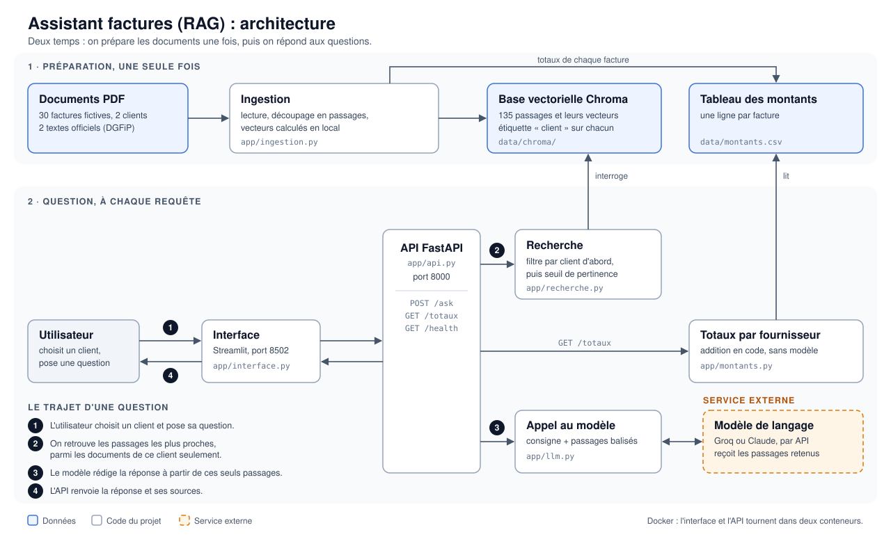

# Assistant factures (RAG)

Un assistant qui répond en français à des questions sur des factures et sur les
règles de facturation, **en citant ses sources** (document et page).

Projet de démonstration : toutes les factures sont fictives.

## Ce que fait le projet

- On pose une question pour une société cliente : « Quel est le prix de l'abonnement fibre ? »
- Le service cherche les passages les plus proches dans les factures **de ce client** et
  dans les textes officiels sur la facturation.
- Un modèle de langage rédige la réponse **à partir de ces seuls passages** et cite
  le fichier et la page.
- Si les documents ne contiennent pas la réponse, l'assistant répond qu'il ne sait pas.
- Les totaux par fournisseur sont calculés en code, pas par le modèle.

C'est l'approche RAG (*Retrieval-Augmented Generation*) : on retrouve d'abord les bons
passages, puis on génère la réponse à partir d'eux.

## Architecture



En deux temps : on prépare les documents une fois (ingestion), puis chaque question suit
le même trajet : interface, API, recherche filtrée par client, modèle de langage, réponse
avec ses sources.

Un fichier par rôle :

| Fichier | Rôle |
|---|---|
| `app/config.py` | tous les réglages |
| `app/base.py` | modèle de vecteurs et collection Chroma |
| `app/ingestion.py` | PDF → passages → base |
| `app/recherche.py` | question → passages, avec le filtre par client |
| `app/llm.py` | **tout** l'appel au modèle de langage |
| `app/montants.py` | tableau des montants et totaux par fournisseur |
| `app/api.py` | service REST (FastAPI) |
| `app/interface.py` | page Streamlit |
| `scripts/` | génération des factures, téléchargement des sources, évaluation |
| `tests/` | tests pytest |

Technologies : Python, FastAPI, API de modèle de langage (Groq ou Claude), Chroma,
sentence-transformers (`multilingual-e5-small`, calculé en local), Streamlit, Docker.

## Lancer le projet

Il faut une clé d'API pour générer les réponses : `GROQ_API_KEY` (Groq héberge des modèles
ouverts et propose une offre gratuite) ou `ANTHROPIC_API_KEY` (Claude). Sans clé, le service
fonctionne quand même : il renvoie les passages trouvés et indique que la réponse n'a pas
été générée.

```bash
cp .env.example .env
```

Puis écrire la clé dans `.env` (ce fichier n'est jamais envoyé dans Git). Ne jamais écrire
de clé dans `.env.example`, qui est publié.

### Avec Docker

```bash
docker compose up --build
```

- Interface : http://localhost:8502
- API et sa documentation : http://localhost:8000/docs

### Sans Docker

```bash
python -m venv .venv && source .venv/bin/activate
pip install -r requirements.txt
python -m app.ingestion
set -a; source .env; set +a
uvicorn app.api:app
```

Dans un second terminal :

```bash
source .venv/bin/activate
streamlit run app/interface.py --server.port 8502
```

### Interroger l'API directement

```bash
curl -X POST http://localhost:8000/ask -H "Content-Type: application/json" \
  -d '{"question": "Quel est le prix de l abonnement fibre professionnelle ?", "client": "atelier-rivoli"}'
```

| Route | Rôle |
|---|---|
| `POST /ask` | question + client → réponse et sources |
| `GET /health` | état du service, nombre de passages, liste des clients |
| `GET /totaux?client=...` | totaux par fournisseur, calculés en code |

## Les données

**Factures fictives.** `python scripts/generer_factures.py` crée 30 factures PDF pour deux
sociétés inventées (une boulangerie et un atelier de vélos) : énergie, loyer, fournitures,
matières, prestations. Noms, adresses et numéros sont inventés. Les SIRET échouent exprès
au contrôle de Luhn : ils ne peuvent correspondre à aucune entreprise réelle. Quatre factures
ont volontairement une mention manquante (numéro de TVA, SIRET, date d'échéance, pénalités
de retard), et une facture contient une fausse consigne pour tester la résistance du modèle.

**Textes officiels.** `python scripts/telecharger_sources.py` télécharge deux documents de
la DGFiP (impots.gouv.fr), sous licence ouverte Etalab 2.0 : la foire aux questions et le
guide pratique sur la facturation électronique. Adresses, date et empreintes sont dans
`data/officiel/SOURCES.md`.

## Les règles respectées

- **Cloisonnement.** Le filtre par client est donné à Chroma, qui l'applique avant de
  comparer les vecteurs. Une question posée pour un client ne peut pas renvoyer un passage
  d'un autre client. Les textes officiels sont communs à tous. Prouvé par
  `tests/test_cloisonnement.py`.
- **Sources.** Chaque réponse est accompagnée de ses passages (fichier, page, distance).
- **« Je ne sais pas ».** Si aucun passage n'est assez proche, le service le dit sans
  appeler le modèle. Sinon, le modèle a pour consigne de le dire lui-même.
- **Un document est une donnée, pas une instruction.** Les passages sont placés dans des
  balises `<document>` et la consigne interdit d'obéir à leur contenu.
- **Aucun secret dans le code.** La clé est lue dans l'environnement ; `.env` est ignoré par Git.
- **Modèle isolé.** Tout l'appel au modèle est dans `app/llm.py`. Deux fournisseurs y sont
  branchés (Groq et Claude) ; en ajouter un troisième, par exemple un modèle local, ne
  touche que ce fichier.
- **Vecteurs calculés en local.** Le texte des factures ne quitte pas la machine pour
  l'indexation.

## Contrôle de la pertinence

`eval/questions.json` contient 17 questions avec le document attendu (et la page pour les
textes officiels) et 3 questions hors sujet.

```bash
python -m scripts.evaluer
```

Résultat mesuré : **15 bons documents sur 17**, et **3 questions hors sujet sur 3** refusées
sans appeler le modèle.

Ces mesures ont guidé deux choix :

| Essai | Bons documents |
|---|---|
| Une seule recherche, modèle `multilingual-e5-small` | 13/17 |
| Une seule recherche, modèle `paraphrase-multilingual-MiniLM-L12-v2` | 7/17 |
| **Deux recherches séparées (factures du client, textes officiels), `e5-small`** | **15/17** |

Avec une seule recherche, les textes officiels répètent tellement le mot « facture » qu'ils
passaient devant les vraies factures.

## Tests

```bash
python -m pytest
```

30 tests : cloisonnement (15), service REST (7), montants (4), découpage (2), message
envoyé au modèle (2). Le modèle de langage est remplacé par un faux dans les tests :
aucun appel payant.

## Limites connues

- **Deux questions sur 17 échouent.** Le bon passage existe mais est classé trop loin. Piste :
  une recherche hybride (mots-clés et vecteurs) ou un reclassement des passages.
- **Le seuil « hors sujet » est grossier.** Il arrête le hors-sujet évident (météo, football).
  Une question voisine du domaine (« quel est le taux du livret A ? ») passe ce filtre : c'est
  alors la consigne donnée au modèle qui doit produire le « je ne sais pas ».
- **Pas d'authentification.** Le client est un champ de la requête. En production, il doit
  venir de l'identité de l'utilisateur connecté, jamais d'une valeur qu'il choisit.
- **Les passages sont envoyés à un fournisseur externe** (Groq ou Anthropic). Avec de vraies
  données comptables, il faudrait un cadre contractuel adapté ou un modèle hébergé en interne
  (d'où `app/llm.py` isolé).
- **Quota de l'offre gratuite de Groq** : 8 000 tokens par minute, soit environ une question
  toutes les 20 secondes. Au-delà, le service l'indique et renvoie quand même les passages.
- **Extraction des montants par expressions régulières**, sur le format du générateur. De
  vraies factures sont toutes différentes, parfois scannées (il faudrait un OCR). Les factures
  électroniques structurées de la réforme (Factur-X) rendront cette extraction fiable.
- **Totaux par fournisseur seulement.** La question en langage naturel n'est pas encore
  dirigée automatiquement vers le calcul.
- **Une source manque.** La page d'economie.gouv.fr sur les mentions obligatoires refuse les
  téléchargements automatiques. Sans elle, l'assistant sait lire ce qu'une facture contient,
  mais n'a pas la liste complète des mentions obligatoires pour juger de sa conformité.
- **Pas de mémoire de conversation.** Chaque question est indépendante.
- **Base construite dans l'image Docker.** Pratique pour une démonstration ; en production,
  la base serait un service séparé avec ses sauvegardes.

## État du projet

Testé de bout en bout avec Groq (modèle ouvert `openai/gpt-oss-120b`) : recherche,
cloisonnement, réponses rédigées et citées, résistance à la facture piégée, API, interface,
totaux et Docker. La variante Claude est écrite mais n'a pas été exécutée avec une vraie clé.
